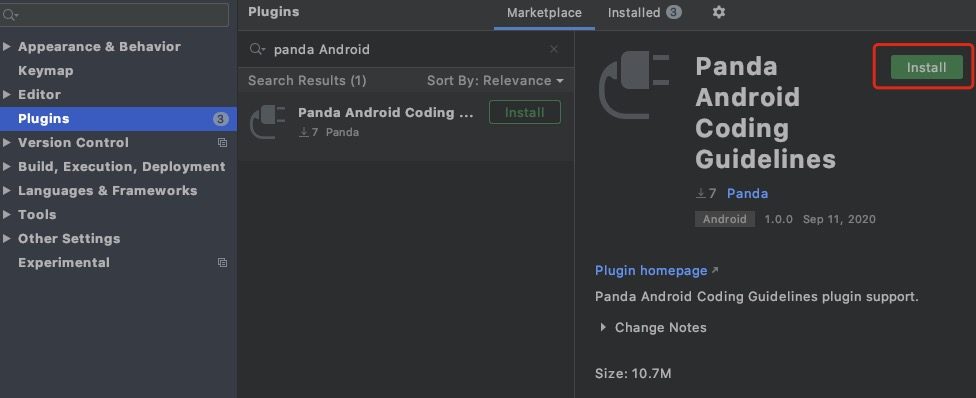
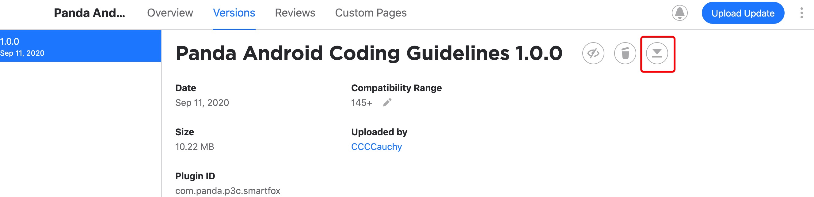
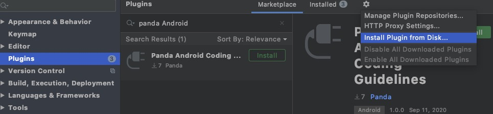
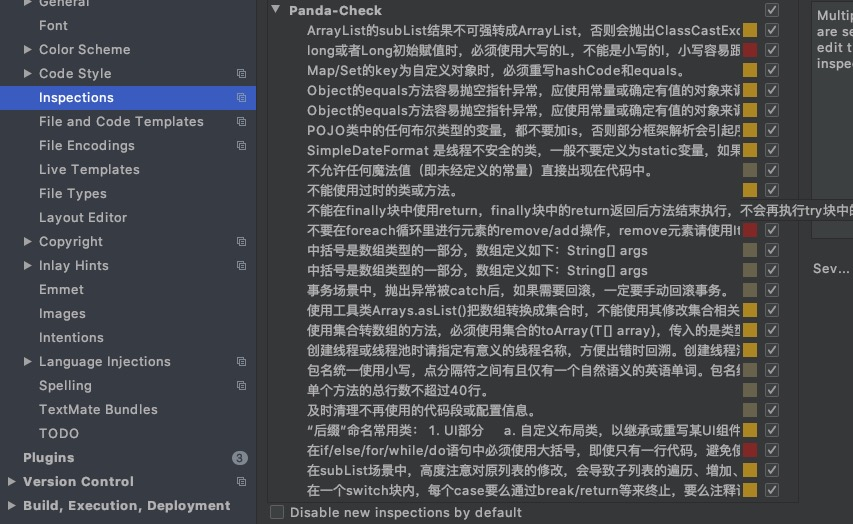
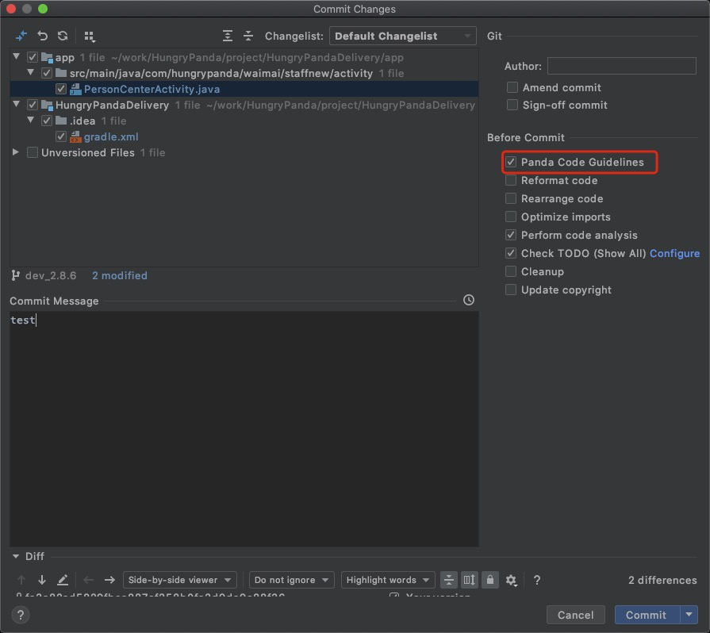

> 插件使用方法和代码运行方式 与 阿里Java代码规范插件(p3c) 完全一致，熟悉p3c的同学可以忽略此文档

## 插件安装
### 通过Jetbrains官方仓库安装
1. 打开 Settings >> Plugins >> Marketplace...在搜索框输入Panda Android即可看到Panda Android Coding Guidelines插件，点击Install进行安装，然后重启IDE生效 `注意：因为插件zip包托管在Jetbrains官方CDN上，所以是从国外的服务器进行下载，可能会出现超时的情况`

### 通过下载安装包进行安装
1. 打开[插件](https://plugins.jetbrains.com/plugin/15055-panda-android-coding-guidelines/versions)页面，选择最新版本下载zip文件

2. Settings >> Plugins >> Install plugin from disk...，选择刚刚下载的zip包安装，然后重启IDE

---

## 插件使用

目前插件实现了开发手册中的大部分规则，部分规则实现了Quick Fix功能，对于可以提供Quick Fix但没有提供的，会尽快实现，也欢迎有兴趣的同学加入进来一起努力。`注意：因为插件fork自阿里规范插件，部分规范和阿里规范相同，只能在一个 Inspections 中看到(不影响使用)，建议安装后将阿里规范插件disable或卸载`

目前插件检测有两种模式：实时检测、手动触发。

### 实时检测
实时检测功能会在开发过程中对当前文件进行检测，并以高亮的形式提示出来，同时也可以支持Quick Fix，该功能默认开启，可以通过配置关闭。

#### 结果高亮提示

检测结果高亮提示，并且鼠标放上去会弹出提示信息。

  

  

#### <a href="https://www.jetbrains.com/help/idea/intention-actions.html">Intention</a> QuickFix功能

Alt+Enter键可呼出Intention菜单，不同的规则会提示不同信息的Quick Fix按钮

  

#### 关闭实时检测  
在某些情况下，我们不希望对代码提示违规信息，比如我们在阅读Github开源项目代码的时候，如果界面出现一堆红色、黄色的提示，此时心里肯定是飘过一万只草泥马。这个时候我们可以通过Inspection的设置关闭实时检测功能。
1. 通过右键快速关闭（打开）所有规则的实时检测功能
  

2. 通过Settings >> Editor >> Inspections 进行手动设置  

也可以关闭某条规则的实时检测功能或者修改提示级别。

### 代码扫描

可以通过右键菜单、Toolbar按钮、快捷键三种方式手动触发代码检测。同时结果面板中可以对部分实现了QuickFix功能的规则进行快速修复。

#### 触发扫描
在当前编辑的文件中点击右键，可以在弹出的菜单中触发对该文件的检测。

   

在左侧的Project目录树种点击右键，可以触发对整个工程或者选择的某个目录、文件进行检测。

   

   如果您打开了IDE的Toolbar，也可以通过Toolbar中的按钮来触发检测，目前Toolbar的按钮触发的检测范围与您IDE当时的焦点有关，如当前编辑的文件或者是Project目录树选中的项，是不是感觉与右键菜单的检测范围类似呢。

   
   使用快捷键（Ctrl+Shift+Alt+J）触发弹出窗口，选择检测范围；您也可自定义快捷键。

   

   

#### 扫描结果  
检测结果直接使用IDEA Run Inspection By Name功能的结果界面，插件的检测结果分级为Blocker、Critical、Major。默认按等级分组，方便统计每个级别错误的数量。

默认情况我们在结果面板需要双击具体违规项才能打开对应的源文件，开启Autoscroll To Source选项，单击面板中的文件名、或者是具体的违规项的时候IDEA会自动打开对应的源文件。

   

#### QuickFix
对于实现Quick Fix的规则，在结果面板中可以直接一键修复

   

   

### 代码提交时检测
1. 在提交代码框勾选Alibaba Code Guidelines选项
   
2. 如果有违反规范的地方会提示是否继续提交，选择取消后会自动对修改的代码进行扫描
   
